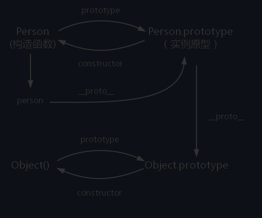

# 原型


#### prototype

每个函数都有一个 prototype，函数的 prototype 指向一个对象，这个对象正是调用该构造函数创建的实例的原型

原型： javascript 对象（除null）在创建的时候就会与之关联另一个对象，这个对象就是原型；每个对象都会从原型继承属性

#### `__proto__`

javascript 对象（除 null）都会具有一个属性，`__proto__` , 这个属性会指向该对象的原型
关联原型组成的的链状结构就是原型链；

#### constructor

每一个原型都有一个 constructor 属性指向关联的构造函数

# 作用域

> 作用域是指程序源代码定义变量的区域。
> 作用域规定了如何查找变量，也就是确定当前执行代码对变量的访问权限。
> javascript 采用词法作用域（静态作用域）

静态作用域与动态作用域
JavaScript 采用的是词法作用域，函数的作用域在函数定义的时候就决定了。
而与词法作用域相对的是动态作用域，函数的作用域是在函数调用的时候才决定的。

#### 执行上下文

当 JavaScript 代码执行一段可执行代码，就会创建一个执行上下文，并且压入执行上下文栈，当函数执行完毕后，就会将函数从执行上下文栈中弹出；

每个执行上下文，都有三个重要的属性

- 变量对象（VO variable object）
- 作用域链
- this

#### 执行上下文栈 【Execution context stack】

栈【stack】
javascript 中使用执行上下文栈来管理执行上下文
初始化的时候首先会向执行上下文栈中压入全局执行上下文，我们用 globalContext 表示，并且只有整个应用程序结束时，ECStack 才会被清空，在程序结束之前 ECStack 最底部永远有 globalContext

```js
function fun3() {
  console.log('fun3');
}
function fun2() {
  fun3();
}
function fun1() {
  fun2();
}
fun1();


/** 执行上下文栈 */
//初始化
ECStack = [
    globalContext
];

ECStack.push(<fun1> functionContext)
ECStack.push(<fun2> functionContext)
ECStack.push(<fun3> functionContext)
// 执行3
ECStack.pop();
// 执行2
ECStack.pop();
// 执行1
ECStack.pop();

/** ECStack永远有gloablContext */
ECStack = [
    globalContext
]
```

```js

var scope = "global scope";
function checkscope(){
    var scope = "local scope";
    function f(){
        return scope;
    }
    return f();
}


checkscope();
/** 初始化 */
 globalContext = {
   VO: [global],
   Scope: [globalContext.VO],
   this: globalContext.VO
  }

 checkscope.[[scope]] = [
      globalContext.VO
    ];
checkscopeContext={
  AO:{
    arguments:{
      length:0
    },
    scope:undefined,
    f:reference to function f(){}
  }
  Scope: [AO, globalContext.VO]
	this: undefined
}
// 执行
 ECStack = [
   checkscopeContext,
   globalContext
 ];
ECStack.push(<checkscope> functionContext)

fContext:{
  AO:{
    arguments:{
      length:0
    }
     scope:undefined,
  }
  Scope:[AO,checkscopeContext.AO globalContext.VO]
  this: undefined
}

 ECStack = [
   fContext
   checkscopeContext,
   globalContext
 ];
ECStack.push(<f> functionContext)

ECStack.pop();
 ECStack = [
   checkscopeContext,
   globalContext
 ];
ECStack.pop();
ECStack = [
   globalContext
 ];
```

```js
var scope = "global scope";
function checkscope(){
    var scope = "local scope";
    function f(){
        return scope;
    }
    return f;
}
checkscope()();
globalContext = {
  VO: [global],
  Scope: [globalContext.VO],
  this: globalContext.VO
}
checkscopeContext={
  AO:{
    arguments:{
      legnth:0
    }
    scope:undefined
  }
  Scope:[AO, globalContext.VO]
}
ECStack.push(<checkscope> functionContext)
ECStack.pop();
ECStack.push(<f> functionContext)
ECStack.pop();
```

具体原因可以参考汤姆大叔的[文章](http://www.cnblogs.com/TomXu/archive/2012/01/30/2326372.html)，简单的说一说，是因为当解释器在代码执行阶段遇到命名的函数表达式时，会创建辅助的特定对象，然后将函数表达式的名称即 b 添加到特定对象上作为唯一的属性，因此函数内部才可以读取到 b，但是这个值是 DontDelete 以及 ReadOnly 的，所以对它的操作并不生效，所以打印的结果自然还是这个函数，而外部的 b 值也没有发生更改。

#### 变量对象(VO variable object)

变量对象是与执行上下文相关的数据作用域，存储在上下文中定义的变量和函数声明。
因为不同执行上下文下的变量对象稍有不同

- 未进入执行阶段之前，变量对象(VO)中的属性都不能访问！但是进入执行阶段之后，变量对象(VO)转变为了活动对象(activation object AO )，里面的属性都能被访问了，然后开始进行执行阶段的操作。它们其实都是同一个对象，只是处于执行上下文的不同生命周期。

1. 全局上下文的变量对象是全局对象
2. 函数上下文的变量对象初始化只包括 Argument 对象
3. 函数进行执行上下文时会给变量对象添加一个形参、函数声明、变量声明等初始的属性值

# JavaScript 深入之作用域链

当查找变量的时候，会在当前上下文变量对象的中查找，如果没有将往父级上下文的变量对象查找，直到查到查找到全局上下文变量（全局变量），这由多个上下文构成的变量对象，构成链表叫作用域链

Reference：参考
EnvironmentRecord：环境记录
MemberExpression: 成员变量表达式

#### 闭包

闭包就是可以访问自由变量的函数
自由变量：函数中使用的变量不是局部变量也不是函数参数的变量；
闭包 = 函数+函数中访问自由变量

从技术层面讲，所有的 javascript 函数都是必报

ECMAScript 中，闭包指的是：

1. 从理论上讲：所有的函数。 因为他们在创建的时候就将上层上下文的数据保存起来了，哪怕最简单的全局变量也是如此，因为函数在访问全局变量就相当于在访问自由变量，这个时候使用的就是最外层作用域。
2. 从实际角度讲：
    1. 即使创建函数的上下文已经销毁，它依然存在（比如，内部的函数从父函数中返回）
    2. 函数中反问自由变量

ECMAScript 中函数传参都是按值传递的
什么事按值传递？

> 把外部的值复制给函数内部的参数，就是把值从一个变量赋值到另一个变量上
> 传递方式有：按值传递、引用传递、按共享专递
> 共享传递的时候会传递对象的引用副本

## Call（呼叫；调用；访问） Apply（申请；适用；套用）模拟实现

> Call 方法在若使用一个指定 this 值个指定的参数值调，和干用函数或者方法

```javascript
var foo = {
  value: 1,
};

function bar() {
  console.log(this.value);
}

Function.prototype.call2 = function (context, ...args) {
  context = context || window;
  context.fn = this;
  const data = context.fn(...args);
  delete context.fn;
  return data;
};
Function.prototype.apply2 = function (context, arr) {
  context = context || window;
  context.fn = this;
  const data = context.fn(...(arr || []));
  delete context.fn;
  return data;
};
```

## bind 实现

> bind 方法创建一个新的函数，当这个新函数被调用，bind 方法的第一个参数将为它运行是的 this，之后的一序列参数将会在传递的实参前传入作为他的参数

```javascript
Function.prototype.bind2 = function (context, ...arg) {
  context = context || window;
  const that = this;

  const fNOP = function () {};
  const newFun = function (...newArg) {
    return that.apply(context, arr.concat(newArg));
  };
  fNOP.prototype = that.prototype;
  newFun.prototype = new fNOP();
  return newFun;
};
```

## new

> new 运算符创建一个用户定义的对象类型的实例或者具有构造函数的内置对象类型之一

```js
function objectFactory() {
  /**  创建一个新的对象 */
  const obj = new Object(null);
  /** 获取第一个参数 */
  let Constructor = [].shift.call(arguments);
  /** 将实例的__proto__属性指向构造函数的prototype */
  obj.__proto__ = Constructor.prototype;
  /** 将this 指向给新的对象 */
  const ret = Constructor.apply(obj, arguments);
  return typeof ret === 'object' ? ret : obj;
}

function NewFn() {
  this.data = '2123';
  this.arg = 'arg';
}

NewFn.prototype.data1 = '21123';

const data = objectFactory(NewFn);
```

## 柯里化 （curry）

柯里化是一种将使用多个参数的函数，转换成一系列只需要一个参数的函数的技术

```js
// 实现 curry
const curry = function (fn, arg) {
  const len = fn.length;
  return function () {
    const data = [...(arg || []), ...arguments];
    fn.apply(this, data);
    return curry.call(this, fn, data);
  };
};
```

## 创建对象的多种方式

#### 工厂模式

对象无法识别，因为所有的实例都指向一个原型

```javascript
function createPerson(name) {
  const person = new Object();
  person.name = name;
  person.getName = function () {
    console.log(this.name);
  };
  return person;
}
```

#### 构造函数模式

优点：实例可以识别一个特定的类型；
缺点：每一次创建实例时，每个方法都要被创建一次

```javascript
function Person(name) {
  this.name = name;
  this.getName = function () {
    console.log(this.name);
  };
}
new Person('jack');
```

#### 原型模式

#### 组合模式

#### 动态原型模式

#### 寄生构造函数模式

继承方法

1. 原型继承
2. 借用构造函数

```js
function Parent() {
  this.names = ['kevin', 'daisy'];
}
function Child() {
  Parent.call(this);
}

var child1 = new Child();
child1.names.push('yayu');
console.log(child1.names); // ["kevin", "daisy", "yayu"]
var child2 = new Child();
console.log(child2.names); // ["kevin", "daisy"]
```

3. 组合继承
4. 原型式继承

.gpt vue 从右往左进入 效果
